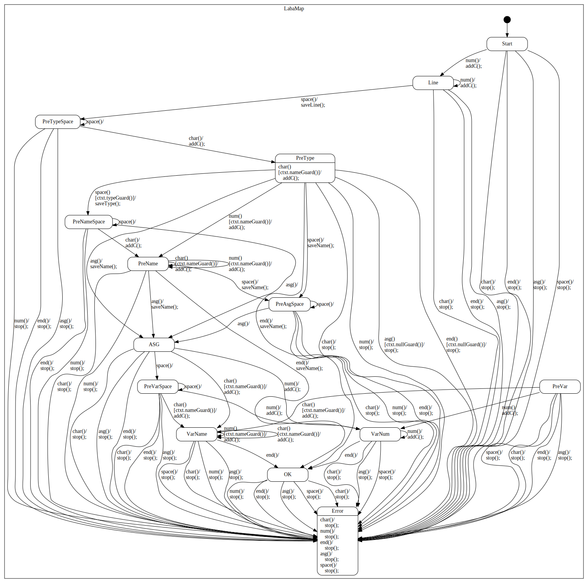

# AT_lab1

## Description
This is my homework №1 for AT lessons :)

## Tools that were used:
- SMC
- Regex
- LeX

## Task
My programm should parse this type of string in three different ways:

```c
<LineNumber> (int|short|long) <varName> (= <varName|Integer>)
```

If the parsed string is correct, the programm should return a NodeVal object, else it will return the string 'Incorrect'.

### Notes
NodeVal object contains information about LineNumber and varName that were entered with the string. 

varName should start with any letter from ```a-zA-Z```  and continue with any letter from ```a-zA-Z0-9``` up to 16 characters.

LineNumber and Integer should start with any digits from ```1-9```.
## Usage

In console you should ```make run``` to select one of three parsers and a dialog mode.
There are two types of a dialog mode:
* Console mode - you can enter your string in the console and see results of the parsers.
* File mode - you can enter to this mode if you run ```python3 ./laba/Dialog.py <fileToParse> (logFile)``` (it's a feature:)).

## Testing
You can put several ```*.test``` files into the ```./tests``` dir and run ```make test``` to generate multiple log files in the ```./tests/logs``` dir for each parser.

## SMC graph

